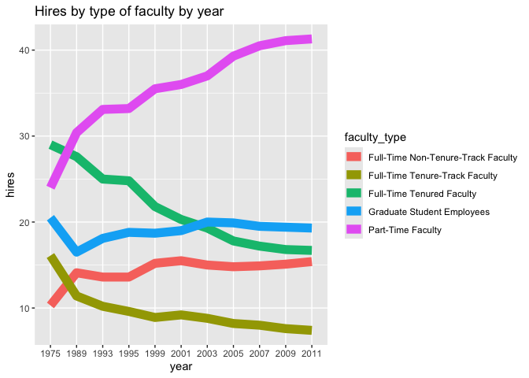
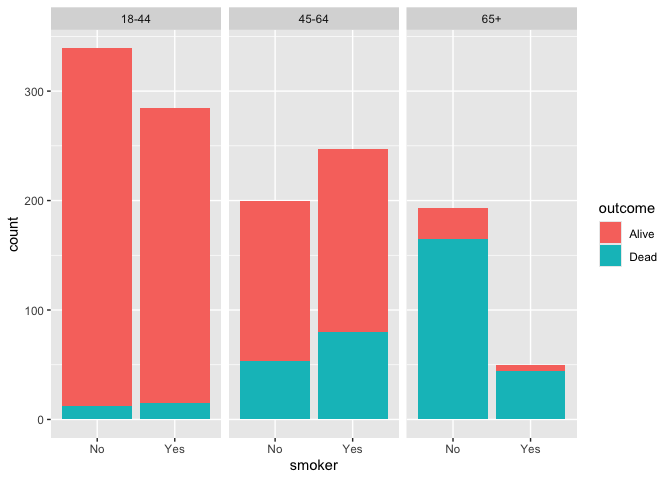

Lab 06 - Ugly charts and Simpson’s paradox
================
George Nesbitt
02/18

### Load packages and data

``` r
library(tidyverse) 
library(dsbox)
library(mosaicData) 
```

``` r
staff <- read_csv("data/instructional-staff.csv")
```

    ## Rows: 5 Columns: 12
    ## ── Column specification ────────────────────────────────────────────────────────
    ## Delimiter: ","
    ## chr  (1): faculty_type
    ## dbl (11): 1975, 1989, 1993, 1995, 1999, 2001, 2003, 2005, 2007, 2009, 2011
    ## 
    ## ℹ Use `spec()` to retrieve the full column specification for this data.
    ## ℹ Specify the column types or set `show_col_types = FALSE` to quiet this message.

``` r
staff_long <- staff %>%
  pivot_longer(cols = -faculty_type, names_to = "year") %>%
  mutate(value = as.numeric(value))
```

``` r
staff_long %>%
  ggplot(aes(
    x = year,
    y = value,
    group = faculty_type,
    color = faculty_type
    
  )) +
  geom_line(size=4) +
  labs(x="year", y="hires", title="Hires by type of faculty by year")
```

    ## Warning: Using `size` aesthetic for lines was deprecated in ggplot2 3.4.0.
    ## ℹ Please use `linewidth` instead.
    ## This warning is displayed once per session.
    ## Call `lifecycle::last_lifecycle_warnings()` to see where this warning was
    ## generated.

<!-- --> \### Exercise
1

``` r
data(Whickham)
glimpse(Whickham)
```

    ## Rows: 1,314
    ## Columns: 3
    ## $ outcome <fct> Alive, Alive, Dead, Alive, Alive, Alive, Alive, Dead, Alive, A…
    ## $ smoker  <fct> Yes, Yes, Yes, No, No, Yes, Yes, No, No, No, No, Yes, No, Yes,…
    ## $ age     <int> 23, 18, 71, 67, 64, 38, 45, 76, 28, 27, 28, 34, 20, 72, 48, 45…

I think that this data most likely came from observational studies
because it would be unethical to run an experiment such as this.
Especially one resulting in the death of lots of people. \### Exercise 2
There are 1,314 rows (observations) and 3 columns. Each column
represents a smoker/non-smoker in whickham.

### Exercise 3

There are three variables (columns). The first variable is outcome, this
is a

### Excercise 4

I would expect there to be a positive relationship between smoking
status and death given there are serious health risk associated with the
behavior.

### Excercise 5

``` r
Whickham %>%
  count(smoker, outcome)
```

    ##   smoker outcome   n
    ## 1     No   Alive 502
    ## 2     No    Dead 230
    ## 3    Yes   Alive 443
    ## 4    Yes    Dead 139

``` r
Whickham %>% 
  ggplot(aes(x=smoker, fill=outcome)) +
  geom_bar()
```

<!-- -->

``` r
labs(
  title="Health Outcomes by smoking status",
  x="Smoking status",
  fill="Outcome"
)
```

    ## <ggplot2::labels> List of 3
    ##  $ x    : chr "Smoking status"
    ##  $ fill : chr "Outcome"
    ##  $ title: chr "Health Outcomes by smoking status"

``` r
Whickham %>% count(smoker, outcome) %>% group_by(smoker) %>% 
  mutate(probability = n /sum(n))
```

    ## # A tibble: 4 × 4
    ## # Groups:   smoker [2]
    ##   smoker outcome     n probability
    ##   <fct>  <fct>   <int>       <dbl>
    ## 1 No     Alive     502       0.686
    ## 2 No     Dead      230       0.314
    ## 3 Yes    Alive     443       0.761
    ## 4 Yes    Dead      139       0.239

### Excercise 6

``` r
Whickham <- Whickham %>% mutate(age_cat=case_when(
                                age <= 44 ~ "18-44",
                                age > 44 & age <= 64 ~ "45-64",
                                age > 64 ~ "65+"))
```

### Excercise 7

``` r
Whickham %>% 
  ggplot(aes(x=smoker, fill=outcome)) +
  geom_bar() + facet_wrap(~age_cat)
```

<!-- -->

``` r
labs(
  title="Health Outcomes by smoking status",
  x="Smoking status",
  fill="Outcome")
```

    ## <ggplot2::labels> List of 3
    ##  $ x    : chr "Smoking status"
    ##  $ fill : chr "Outcome"
    ##  $ title: chr "Health Outcomes by smoking status"

You can tell that the amount of dead people increased as age increased.
This is the case for both smokers and non smokers, however in each age
group there is a higher percentage of dead in smokers.

``` r
Whickham %>% count(smoker, outcome, age_cat) %>% group_by(smoker) %>% 
  mutate(probability = n /sum(n))
```

    ## # A tibble: 12 × 5
    ## # Groups:   smoker [2]
    ##    smoker outcome age_cat     n probability
    ##    <fct>  <fct>   <chr>   <int>       <dbl>
    ##  1 No     Alive   18-44     327      0.447 
    ##  2 No     Alive   45-64     147      0.201 
    ##  3 No     Alive   65+        28      0.0383
    ##  4 No     Dead    18-44      12      0.0164
    ##  5 No     Dead    45-64      53      0.0724
    ##  6 No     Dead    65+       165      0.225 
    ##  7 Yes    Alive   18-44     270      0.464 
    ##  8 Yes    Alive   45-64     167      0.287 
    ##  9 Yes    Alive   65+         6      0.0103
    ## 10 Yes    Dead    18-44      15      0.0258
    ## 11 Yes    Dead    45-64      80      0.137 
    ## 12 Yes    Dead    65+        44      0.0756
